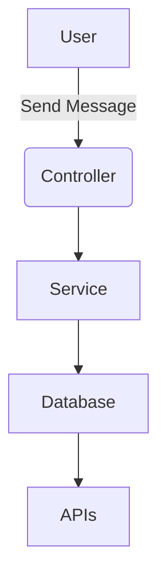
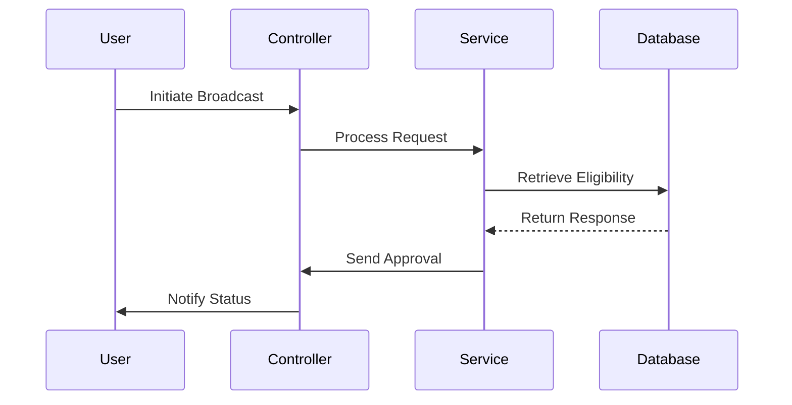
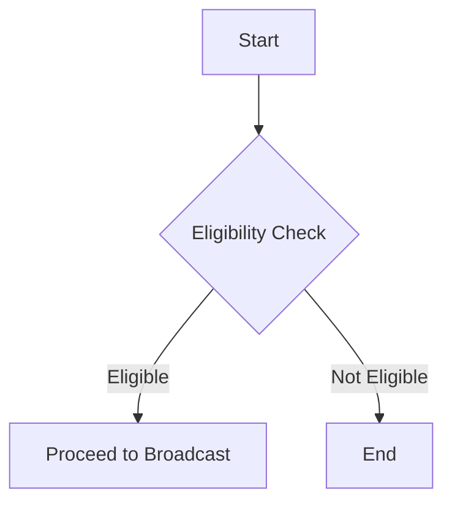
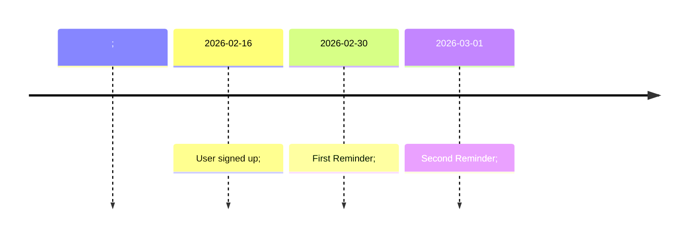
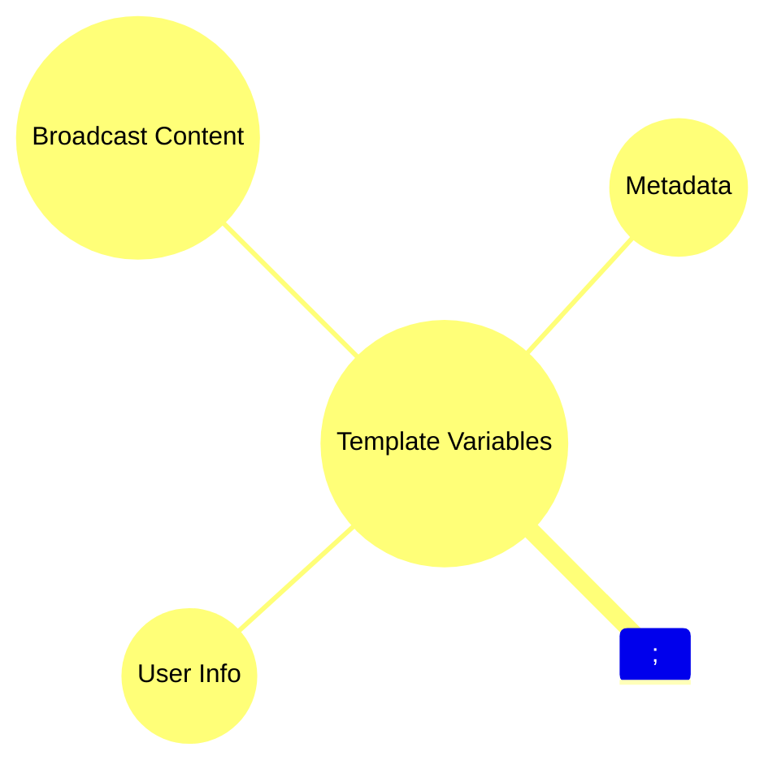

# Telegram Broadcast Flow Logic

## Component Architecture


## Broadcast Flow


## Customer Eligibility


## Bonus Reminders


## Cron Execution
```mermaid
cronGraph;
    A[Daily Job] --> B{Check Time};
    B -->|Execute| C[Run Broadcast Flow];
```

## API Endpoints
```mermaid
classDiagram;
    class API {
        +POST /broadcast
        +GET /status
        +POST /reminders
    }
```

## Template Variables


## Data Schema
```mermaid
classDiagram;
    class Broadcast {
        +id: String
        +content: String
    }
    class User {
        +id: String
        +name: String
        +eligibility: Boolean
    }
    Broadcast <-- User;
```
