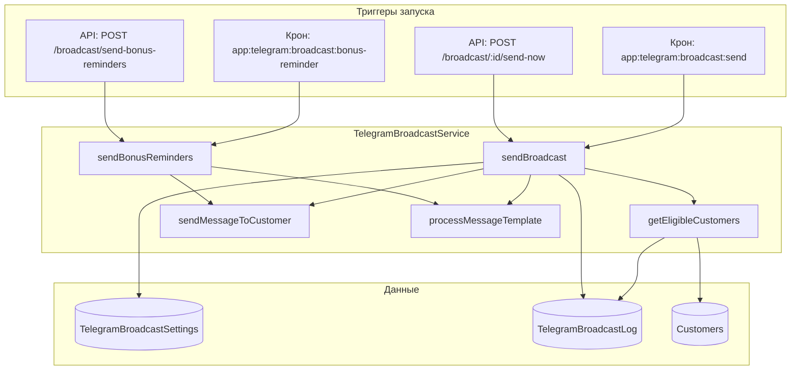
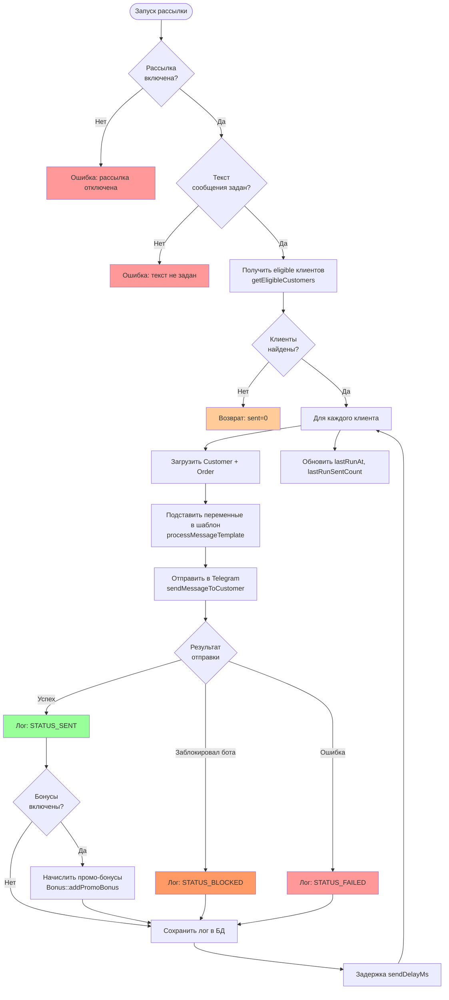
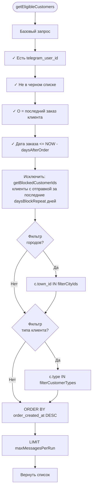
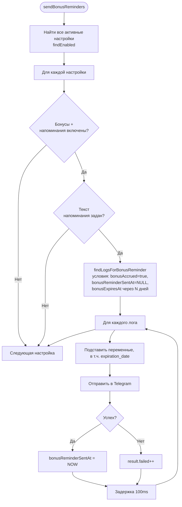
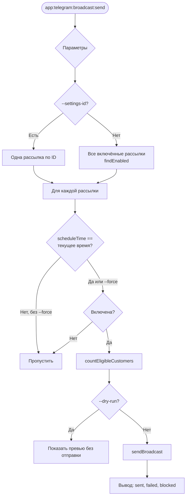
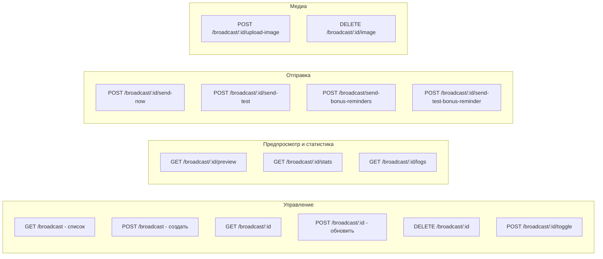
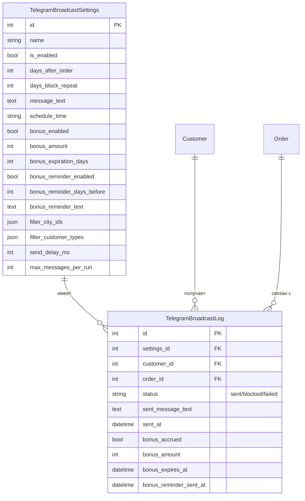

# Логика работы Telegram-рассылок

## Общая схема компонентов

## Основная рассылка (sendBroadcast)

## Критерии отбора клиентов (getEligibleCustomers)

## Напоминания о сгорании бонусов (sendBonusReminders)

## Запуск по крону (TelegramBroadcastSendCommand)

## API эндпоинты

## Переменные шаблона сообщения

| Переменная | Описание |
|------------|----------|
| `{name}` | Имя клиента (или «Клиент») |
| `{full_name}` | Полное имя |
| `{first_name}` | Имя |
| `{phone}` | Телефон |
| `{order_number}` | Номер последнего заказа |
| `{order_date}` | Дата заказа (ДД.ММ.ГГГГ) |
| `{bonus_amount}` | Количество бонусов |
| `{bonus_expiration_days}` | Срок действия (дней) |
| `{bonus_expiration_date}` | Дата сгорания |
| `{expiration_date}` | В напоминаниях: дата сгорания |

## Схема данных

